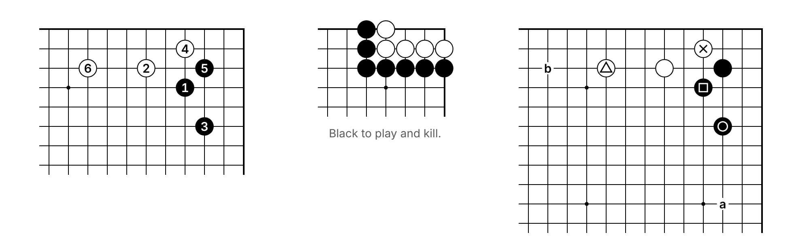
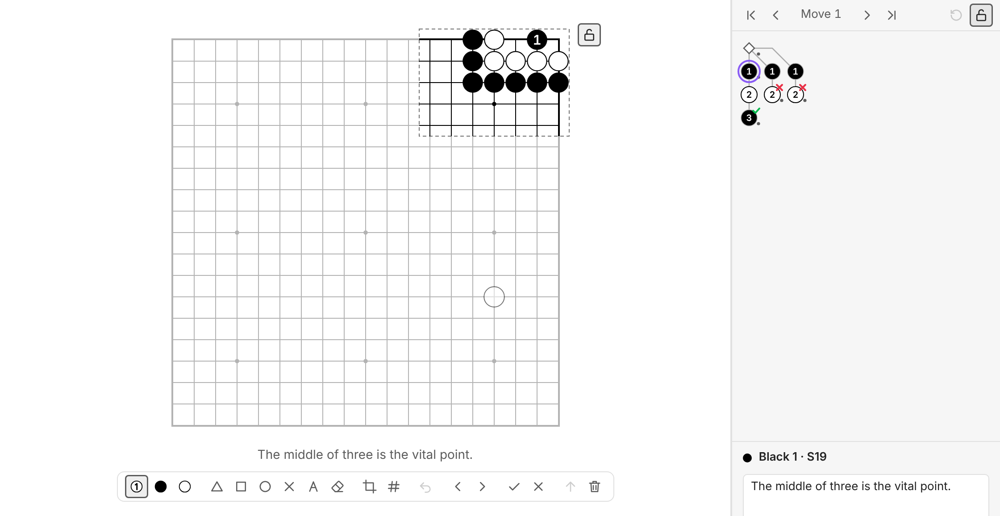
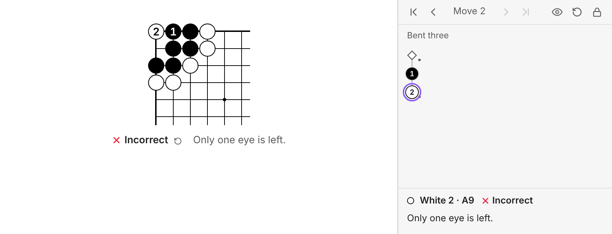

# Kifu

Go boards for Obsidian notes that look like the diagrams in a book: black ink, thin lines, numbered stones, nothing shiny. A board can be

- a **position** — the whole board or just a corner, with triangles, squares and letters on it;
- a **numbered figure** — a sequence shown as stones 1, 2, 3…;
- a **problem** — you click a move and the lines you saved answer it, until the line ends *correct* or *incorrect*.

Boards are stored as SGF, either right in the note or in an `.sgf` file the note points at.



*(The pictures on this page were made with the plugin's test page, which imitates Obsidian's default theme.)*

## Install

In Obsidian open **Settings → Community plugins → Browse**, search for **Kifu**, install it and switch it on.

To install it by hand instead, download `main.js`, `manifest.json` and `styles.css` from the [latest release](https://github.com/LuxBetancourt/obsidian-kifu/releases/latest), put them in a folder `<your vault>/.obsidian/plugins/kifu/`, and switch **Kifu** on under **Settings → Community plugins** (press the refresh button next to *Installed plugins* if it is not listed).

Needs Obsidian 1.13 or later. It works on desktop, tablet and phone. It never goes online and reads nothing outside your vault. The only time it looks through the vault's files is when you open the SGF file picker, which lists the `.sgf` files to choose from; a board reads only the file it points at.

To see everything at once, copy the two files in `demo/` into your vault and open *Kifu demo*.

## A first board

Run the command **Kifu: Insert board** (or right-click in the editor: **Kifu → Insert board**), or type the block yourself:

````markdown
```kifu
```
````

That is an empty 19 × 19 board.

- **Hover** over it: a lock appears beside its upper right corner. (On a touch screen it is always there, faintly.)
- **Locked** (the normal state), clicking plays stones — captures, ko and all — but nothing you do is saved. Once you have played, ‹ › buttons appear under the lock: ‹ takes back your last move, › plays it again. They only step through what you played, never into the moves saved in the block, so they do not give a problem's answer away. The ↺ button, or `Esc`, puts everything back.
- **Click the lock** to edit. Tools appear under the board, and what you do now is written into the block as SGF. Click the lock again when you are done.

What a locked board shows:

- a **problem** shows its starting position;
- any other board shows the **last position of its main line** — so a sequence you drew with the play tool looks the way you left it;
- a `numbers:` line turns that into a numbered figure, and a `move:` line picks another position (`move: 0` is the start). The ⚑ tool writes that line for you.

## Editing

While a board is unlocked the whole board is shown, with the part that will be hidden afterwards faded, and the moves carry their numbers (unless a `numbers:` line or the settings say otherwise).



| Tool | What it does |
| --- | --- |
| ① Play | Plays moves, alternating colours, and builds the tree: go back and play something else to add a variation. Click the tool again to change who plays next from here. |
| ● ○ Stones | Puts a stone down without it being a move (for setting up a position). Click a stone of the same colour to take it off. |
| △ □ ○ ✕ | Marks. They belong to the move you are on, so every move can carry its own. |
| A | Labels. The little box holds the next label: type `a`, `A`, `1`, `51`… and each click counts on from there. |
| Eraser | Removes a mark or label; a second click removes the stone under it. |
| Crop | Drag to choose the part of the board the locked board shows. Double-click (or double-tap) to go back to the automatic crop. |
| ⚑ Start | Makes the position on the board the one the locked board opens at, by writing a `move:` line. Click it again on that position to take the choice back. Only positions on the main line can be chosen: step there with ‹ › first. A problem chosen this way is solved from that position. |
| # | Makes the locked board a *numbered figure* of the main line, or takes the numbers off again. Whatever a `numbers:` line said before is put back, so a range like `51-100`, or an `off`, is not lost by trying the switch. |
| ↶ | Undo (`Ctrl/Cmd+Z` while the board has the keyboard; `Ctrl/Cmd+Shift+Z` or `Ctrl+Y` redoes). |
| ‹ › | Previous / next move. |
| ✓ ✗ | Mark the line through this move as correct or incorrect. |
| ↑ | Move this variation up, towards being the main line. |
| 🗑 | Delete this move and everything after it. |

Two things worth knowing:

- If you have been playing on a locked board and then unlock it, the line that is on the board is kept and becomes part of the tree. (Undo takes it out again.)
- Locking puts the board back to the position the note shows.

Comments are written in the **move tree** panel (see below).

## Problems

A problem is a starting position plus the lines you saved from it.

1. Unlock an empty board and set the position up with the stone tools (stones of both colours: that is what tells the plugin it is a problem).
2. Switch to **Play** and play the answer; the plugin alternates colours. Go back (‹) and play other tries to add them as variations.
3. Mark lines with ✓ and ✗ if you like, add comments in the panel, lock.

On the locked board the solver's move is looked up in the tree. If it is there, a saved reply is played after a short pause (where you saved several, one of them at random, so the problem does not always answer the same way; the settings can make it always the first); if it is not, the move is simply *incorrect*. When a line ends a large ✓ or ✗ appears over the board for a moment, and the verdict and the line's comment stay underneath.

Stuck? The eye button under the lock shows the solution: the board starts over and plays out the first saved line judged correct, with the moves numbered, and the move tree panel shows all the saved lines. Step back through it with ‹ ›, or start over with ↺. (No ✓ appears for an answer that was shown rather than found.)



How a line is judged:

- A ✓ or ✗ on a move covers everything after it; the mark nearest the end of the line wins.
- A line with no mark at all is **incorrect** if some other line is marked ✓. If nothing anywhere is marked ✓, the **main line** (the first one you entered) is the answer and every other line is incorrect.
- "Main line" is about the solver's moves only: where the other side has several saved replies, every one of them keeps you on it.

So the quickest way to write a problem is: enter the answer first, then the failures, and mark nothing.

SGF files from elsewhere work too. `TE` and `BM` are read as ✓ and ✗ (that is also what the plugin writes). So is a comment on a move that opens with "Correct", "Right", "Solved", "Success", "Wrong", "Incorrect" or "Fail…" as a word of its own, or that begins or ends with `RIGHT` in capitals, the way files from goproblems.com do.

A board is treated as a problem when its position was **set up with stones of both colours** and there are **moves saved** from it. Marks alone do not make one: a reviewed game has its good and bad moves marked too, and stays a game record. Say `problem: yes` or `problem: no` to decide yourself, or use the switch: the **?** button under the lock while a board is unlocked, or **Kifu → Problem board** in the editor's right-click menu (for the board you right-clicked, or the block the cursor is in). The switch writes a `problem:` line only when the board would not decide the same by itself. A board that is not a problem still follows saved moves and answers them, but it does not judge by itself: only a line you marked ✓ or ✗ shows its verdict, once it has been played out to the end. With `problem: no`, nothing is judged at all.

To keep a problem from looking familiar, press the **shuffle** button under the lock while the board is unlocked (or write `randomize: on`). Each time the note is opened, the locked board is then shown turned or mirrored (any of the eight ways for a square board; a board that is not square is only mirrored), and half the time with the colours swapped, so a "Black to play" problem becomes "White to play". Captions and comments follow: "Black" and "White" in them change places. Only the picture changes: what you play is looked up as recorded, and unlocking shows the board the way it is written.

## Figures and numbers

Press **#** while editing — or add `numbers: on` — and the locked board shows the main line played out with the stones numbered.

````markdown
```kifu
numbers: on
(;GM[1]SZ[19];B[pd];W[nc];B[qf];W[pb];B[qc];W[kc])
```
````

For a stretch of a longer game, give the moves:

| Line | Shows |
| --- | --- |
| `numbers: on` | every move, numbered from 1 |
| `numbers: 51-100` | the position after move 100, with moves 51–100 numbered 51–100 |
| `numbers: 51-100 from 1` | the same stones numbered 1–50 |
| `numbers: on from 7` | every move, the first one called 7 |
| `numbers: off` | no numbers on this board, not even while playing |
| `move: 50` | just the position after move 50, no numbers |

A figure is drawn the way kifu are printed: a stone captured during the figure stays where it was, and a move played on an occupied point is listed underneath ("⑦ at ③"). As soon as you step through the moves or play on, you see the real position.

To number stones that are *not* moves — or to start anywhere you like — use the label tool and type the first number into its box.

## Showing part of the board

By default a board is cropped to its stones (every variation counts), with two lines of margin, and snaps to the edge when the edge is close. Lines that run off a cut side are left open, as in print; real edges get the heavy border. Star points are drawn for any size.

Use the crop tool, or a `view:` line:

| Line | Shows |
| --- | --- |
| `view: full` | the whole board |
| `view: auto` | cropped to the stones |
| `view: top-right` | a corner (also `top-left`, `bottom-left`, `bottom-right`; `tr`, `ne` … work too) |
| `view: top` | a side (also `bottom`, `left`, `right`) |
| `view: center` | the middle |
| `view: top-right 9x7` | a corner 9 columns wide and 7 rows tall |
| `view: top 6` | the top six rows |
| `view: K10-T19` | exactly this rectangle |

Board size comes from the SGF (`SZ[13]`, `SZ[19:13]`). For a new board use `size: 13` or `size: 13x9`, or change the default in the settings.

## Pointing at SGF files

````markdown
```kifu
sgf: [[Cho Chikun - Elementary.sgf]]
game: 12
```
````

- `sgf:` takes a wikilink, a file name, or a path from the vault root or the note's folder. The command **Kifu: Insert board from an SGF file**, or **Kifu → Display SGF file…** in the editor's right-click menu, lets you pick one. Only `.sgf` files are ever used: a note that happens to have the same name is left alone.
- `game:` picks a game from a file that holds several (problem collections usually do). The first is 1.
- Every other option works as usual, so several boards can show different moves or corners of one file.
- Unlocking and editing such a board changes **the file**; the note keeps pointing at it. Other boards on the same file follow. If the file changes on disk (sync, another program) open boards reload.
- A board that could not show its file (not found, no such game in it) looks again when a file appears, moves or changes.
- A file that is not UTF-8, or whose game is cut short (no closing parenthesis), is shown but cannot be edited from here.
- A game record shows its last position; add `move:` or `numbers:` to show another.

Obsidian only lists `.sgf` files in its file explorer when **Settings → Files and links → Detect all file extensions** is on. If a board cannot find a file that is there, turn that setting on.

## The move tree panel

The panel lives in the right sidebar (command **Kifu: Show move tree**; on a computer it also comes forward when you unlock a board). It follows the board you last used and shows

- the tree, moves running downwards and variations branching to the right — click any move to go there; dashed stones are ones you played on a locked board and are not saved;
- ✓ / ✗ on lines that carry a verdict, and a dot on moves that have a comment;
- the comment of the current move — a text box while the board is unlocked.

While a **problem** is locked the panel keeps the answers to itself: it shows only the moves that are on the board. The eye button shows all the saved lines; starting over hides them again. (There is a setting for this. Stepping forward with `→` walks along a saved line, so that shows the answer too.)

## Keys

With the keyboard on a board (click it) or on the panel:

| Key | |
| --- | --- |
| `←` `→` | previous / next move |
| `↑` `↓` | previous / next variation |
| `Home` `End` | first position / end of the line |
| `Esc` | locked: back to the resting position · unlocked: lock · while dragging a crop: never mind |
| `Ctrl/Cmd+Z` | unlocked: undo · locked: take back your last step |
| `Ctrl/Cmd+Shift+Z`, `Ctrl+Y` | unlocked: redo · locked: make that step again |

In the panel's comment box every key belongs to the text you are typing, undo included.

While a board has the keyboard, what you type, paste or undo stays with the board and never reaches the note's text. Obsidian's own hotkeys keep working, though — including ones that act on the editor.

## All options

Option lines come first in the block, one per line, before any SGF.

| Option | Values | |
| --- | --- | --- |
| `sgf` | link or path | take the game from a file |
| `game` | number | which game, when the file (or the block) holds several |
| `size` | `19`, `13x9` | size of a board with no SGF yet |
| `view` | see above | part of the board to show |
| `move` | number, `last` | position to show |
| `numbers` | see above | numbered figure |
| `scale` | `80%`, `1.5` | size of this board |
| `coords` | `on` / `off` | coordinates beside the board's edges (the real ones, where the part shown has any) |
| `caption` | text | text under the board at rest |
| `comments` | `on` / `off` | show move comments under the board |
| `problem` | `yes` / `no` | judge moves or not |
| `style` | `paper` / `theme` | white paper, or the theme's colours |
| `align` | `left` / `center` / `right` | |
| `randomize` | `on` / `off` | show the board turned, mirrored and maybe recoloured, a new way each time the note opens |

## Settings

**Settings → Kifu** holds the defaults: scale, colours, crop, coordinates, alignment, new board size, whether played moves are numbered, whether comments show under the board, how replies are chosen (a random saved answer, or always the first) and how long they wait, whether the panel hides a problem's answers, and whether unlocking brings the panel forward. Every one of them is only a default: an option line in a block wins.

## Changing the look

The drawing is plain SVG coloured by CSS variables, so a snippet can restyle it:

```css
.kifu {
	--kifu-font: "Gill Sans", sans-serif; /* numbers and letters */
	--kifu-ink: #111;                      /* lines, outlines, labels */
	--kifu-paper: #fdfcf8;                 /* background */
	--kifu-black: #111;                    /* black stones */
	--kifu-white: #fff;                    /* white stones */
}
```

## Speed

- The whole plugin is one small file (about 75 kB) with no libraries in it.
- Starting Obsidian only *registers* things: nothing is read, parsed or drawn, and no settings file is opened, until a board is actually on screen. In the test page, loading the file takes about 3 ms and starting the plugin well under 1 ms.
- A board is around fifteen SVG nodes however many stones it has (all stones of one colour share a path), plus one per label. Drawing one takes a millisecond or so; a full board with 180 numbered stones, about 5 ms.

## Good to know

- **Saving** changes only the lines between a block's two fences, and of those only the option lines and the one game the board shows: a second game or a remark you put in the block stays as it is. While the note is open in an editor the change goes through the editor, so the note's own undo takes it back.
- **Which block is whose.** A board knows its block by its place among the note's boards (the third of five, say) and by the block's exact text. As the note changes, that place is carried along one change at a time, the way an editor carries a cursor: text typed elsewhere, or boards added, removed and moved around, do not send an edit to the wrong lines. In an editor the board simply moves with its block. An edit is written only where place and exact text both still fit. If the block itself was changed or removed while an edit was waiting for it (by hand, by a sync, by the same board open in another pane), or the note was rearranged so thoroughly in one go that it is no longer certain which block is meant, nothing is written and a notice says so. An edit that was refused is gone, it does not wait for a later chance: the board goes back to what it was drawn from.
- **Boards that read exactly the same** (a row of empty boards, say) are kept apart by their places. The one thing a note's text cannot show is which is which once identical blocks have traded places; an edit then goes to the block under the board that shows it. A board that was left unlocked or played out and then scrolled out of sight comes back the way you left it, with one exception: a board that has twins comes back locked if the note was edited by hand meanwhile, rather than risk unlocking the wrong one.
- Where Obsidian does not tell a board which lines it stands on (an embedded note is the likely case), the board is found by its text, provided no other board of the note reads the same. Two that do cannot be told apart there: the edit is refused with a notice, and giving one of them a `caption:` line settles it. In the editor and the reading view this does not arise.
- If the note or an SGF file cannot be written (a sync program has it locked, a drive has stopped answering), the edit stays on the board and saving is tried again by itself; a notice says so once. Edits still waiting when you switch the plugin off or quit Obsidian are written first.
- A block whose SGF is not closed properly (a missing `)`) is shown but cannot be edited, so that nothing after it gets swallowed. A `game:` line asking for a game the block does not have shows a message instead of a board.
- Changing only an option (the crop, the figure switch) leaves the SGF text exactly as you wrote it. Changing the game writes that game out afresh: properties the plugin does not understand are kept, line breaks are its own.
- An SGF file that is not UTF-8 is displayed using its `CA` charset.
- Links inside code blocks are not tracked by Obsidian, so renaming an `.sgf` file does not update `sgf:` lines. Moving it to another folder is fine as long as the name stays unique.
- Passes in an SGF file are stepped over correctly, but there is no pass button yet.
- A board in a Canvas text card can be viewed and played, not edited.

## Status

Version 1.0.0, the first public release. Besides being used in Obsidian on the desktop, it is checked automatically: the built plugin runs in a browser against a stand-in for the Obsidian API, with Live Preview played by a real CodeMirror editor, and on touch screens in Safari's engine (WebKit) as well as Chromium. Wherever Obsidian's behaviour is not documented, the checks are run with the stand-in behaving both ways. The part that writes into notes got the most attention: it was reviewed independently three times, and is exercised by a randomized test on top of the fixed scenarios.

Found a bug, or a board that looks wrong? Please [open an issue](https://github.com/LuxBetancourt/obsidian-kifu/issues), with the block's text if you can.

## License

[GNU General Public License v3.0](LICENSE).

## Building it yourself

```bash
npm install
npm run build          # type-check and bundle main.js
npm test               # unit tests: SGF, rules, sessions, finding blocks in Markdown
npm run test:browser   # the built plugin in Chromium (once: npx playwright install chromium)
npm run test:monkey    # randomized runs of the same, a few minutes
npm run lint           # Obsidian's own lint rules
```

- `tests/*.test.ts` — unit tests. `markdown.test.ts` checks the code that finds and rewrites a block against a CommonMark parser on thousands of generated notes.
- `tests/harness/obsidian-mock.js` — the stand-in for the Obsidian API; `cm-lp.ts` — Live Preview on a real CodeMirror 6.
- `tests/harness/touch.mjs` — taps on tablet and phone profiles, in WebKit (once: `npx playwright install webkit`) and Chromium.
- `tests/harness/interact.mjs`, `editor.mjs`, `identity.mjs` — the scenarios (the last one is all about boards that read the same, notes rearranged under a board, panes that are behind, and writes that fail); `ONLY='pattern'` in the environment runs the scenarios whose names match. `perf.mjs` — timings; `shots.mjs`, `docs.mjs` — pictures.
- `tests/harness/monkey.mjs` — a "monkey" that places and removes stones, marks and labels, types comments, locks, scrolls and (in its rougher profiles) edits the note by hand at the same time: types into blocks, deletes, copies and moves them, undoes, changes the file from outside. It does so in ten arrangements of panes and five kinds of note, most of them full of identical boards. After every step it checks that nothing is in a block other than the one whose board was used, and at the end that nothing outside the blocks changed, that every board shows what its block says, that no edit vanished without a notice, that none vanished at all from a block nobody had touched by hand, and that nothing typed by hand was taken back. `node tests/harness/monkey.mjs live,both hands 1-10` runs chosen arrangements, profiles and seeds.

### Releasing

1. Put the new version (`x.y.z`) in `manifest.json` and `package.json`, and add it to `versions.json` with the lowest Obsidian version it needs.
2. Commit, then push a tag that is exactly the version: `git tag 1.0.1 && git push origin 1.0.1`.
3. The release workflow (`.github/workflows/release.yml`) checks that the tag matches the manifest, builds, runs the unit tests and publishes the release with `main.js`, `manifest.json` and `styles.css`. Obsidian picks it up from there.
